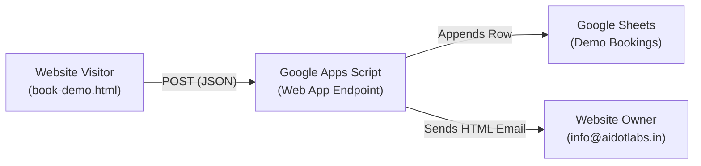

# 📊 AI.LABS Demo Booking — Google Sheets & Email Notification Setup

This guide walks you through connecting the interactive **Demo Booking Form** on your website to **Google Sheets** and setting up instant **Email Notifications** for every submission using Google Apps Script.

---

## 🌟 How It Works


- **Zero Third-Party Cost**: Completely free with unlimited submissions through Google Sheets and Google Workspace/Gmail.
- **Instant Row Insertion**: Each submission creates one row in your spreadsheet.
- **Rich Email Alerts**: The website owner receives an email formatted with AI.LABS styling, contact details, and a direct call button.

---

## 🛠️ Step-by-Step Setup Guide (5 Minutes)

### Step 1: Create Your Google Sheet
1. Open [Google Sheets](https://sheets.new) in your browser.
2. Rename the spreadsheet to: **`AI.LABS Demo Bookings`**.
3. In row 1, add these exact column headers:

| Column | Header Name |
| :--- | :--- |
| **A** | `Timestamp` |
| **B** | `Looking For` |
| **C** | `Demo Audience` |
| **D** | `Student Count` |
| **E** | `Full Name` |
| **F** | `School / Organization` |
| **G** | `Email` |
| **H** | `Mobile Number` |

*(Note: The script will also format the headers automatically with blue background upon the first entry).*

---

### Step 2: Open Apps Script
1. In your Google Sheet, click on **Extensions** in the top menu bar.
2. Select **Apps Script**.
3. Rename the Apps Script project (top left) to: **`AI.LABS Demo Bridge`**.

---

### Step 3: Paste the Backend Code
1. Erase any default code in the editor (`function myFunction() { ... }`).
2. Open the file [`google-apps-script/Code.gs`](file:///D:/ai.dot%20labs/google-apps-script/Code.gs) in this project.
3. Copy all of its contents and paste them into the Apps Script editor.
4. Update the owner email at the top of the script:
```javascript
const CONFIG = {
  // Replace with the email address where you want to receive new demo notifications
  OWNER_EMAIL: 'info@aidotlabs.in',
  
  SPREADSHEET_ID: '', // Leave empty if script is inside your Google Sheet
  SHEET_NAME: 'Demo Bookings'
};
```
5. Click the **Save** disk icon (or press `Ctrl + S`).

---

### Step 4: Deploy as a Web App
1. At the top right of the Apps Script window, click the blue **Deploy** button.
2. Select **New deployment**.
3. Click the gear icon (⚙️) next to *Select type* and choose **Web app**.
4. Configure the deployment settings:
   - **Description**: `AI.LABS Demo Form v1`
   - **Execute as**: **Me (`your-google-account@gmail.com`)**
   - **Who has access**: **Anyone** *(Important: Must be "Anyone" so visitors can submit the form)*
5. Click **Deploy**.

---

### Step 5: Authorize Permissions
1. Google will show an **Authorization Required** prompt.
2. Click **Authorize access** and choose your Google account.
3. If you see *"Google hasn't verified this app"*:
   - Click **Advanced** (bottom left).
   - Click **Go to AI.LABS Demo Bridge (unsafe)**.
   - Click **Allow**.

---

### Step 6: Copy Web App URL & Link to Website
1. Once deployed, copy the **Web app URL** provided in the popup:
   *(Format: `https://script.google.com/macros/s/AKfycbx.../exec`)*
2. Open [`js/book-demo.js`](file:///D:/ai.dot%20labs/js/book-demo.js) in your codebase.
3. At the top of the file, paste your Web App URL into `DEMO_CONFIG.APPS_SCRIPT_URL`:

```javascript
// Configuration for Demo Booking Google Sheets backend
const DEMO_CONFIG = {
    // Paste your Google Apps Script Web App URL here after deployment
    APPS_SCRIPT_URL: 'https://script.google.com/macros/s/YOUR_DEPLOYMENT_ID/exec'
};
```
4. Save the file.

---

## 🧪 Testing Your Setup
1. Open `book-demo.html` in your browser.
2. Click **Start Demo**.
3. Select an option for each of the 3 questions:
   - *Question 1*: e.g., "School Partnership"
   - *Question 2*: e.g., "School"
   - *Question 3*: e.g., "50–100"
4. Fill in the Details form:
   - Full Name: `Test Principal`
   - Organization: `Apex International School`
   - Email: `principal@apexinl.edu`
   - Mobile: `9876543210`
5. Click **Book My Demo →**.
6. **Verify Results**:
   - Check your **Google Sheet**: A new row will appear with timestamp and all 7 fields.
   - Check your **Email Inbox**: An alert email with subject `🚀 New Demo Booking: Test Principal (Apex International School)` will arrive within seconds.

---

## ❓ Frequently Asked Questions & Troubleshooting

### Q: Why didn't an email arrive?
- Verify `OWNER_EMAIL` in `Code.gs` is typed correctly.
- Check your Gmail **Spam / Updates** folder.
- In Apps Script, click on **Executions** in the left sidebar to view real-time logs and errors.

### Q: I updated `Code.gs`. Why aren't changes taking effect?
- When modifying Google Apps Script code, always create a **New Version**:
  1. Click **Deploy** > **Manage deployments**.
  2. Click the edit pencil icon ✏️ on the active deployment.
  3. Change Version dropdown to **New version**.
  4. Click **Deploy**.

---
*Powered by AI.LABS & RoboAI Hub*
